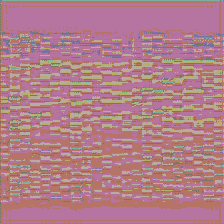

### EEG Art Using Neural Style Transfer

Yo wassup thank you for reading me. This project converts EEG signals into artwork using Neural Style Transfer (NST). It uses MNE's Sleep-EDF EEG dataset to generate spectogram images of brain activity and applies a style image to create EEG Art. 

## Features
 - Downloads and preproccesses EEG data
 - Extracts and visualizes EEG frequency bands
 - Generates RGB spectrogram images of EEG segments
 - Applies NST using a style image and the VGG19 network

## Example output

